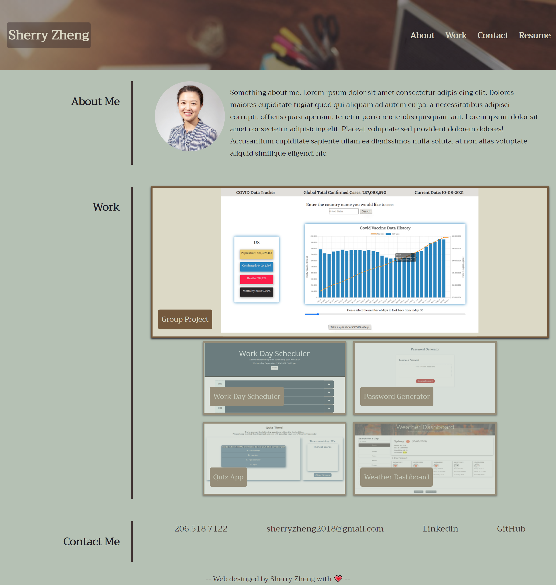

# HW2 Sherry's portfolio page

## Appearance and functionality:

* The header contains developer's name and a navigation bar with links to corresponding sections about Sherry's introduction, her work and how to contact her

* The main body contains three sections, including 'About Me', 'Work', and 'Contact Me'

* The first application's image is larger than the others and presented a hover effect with a scale and opacity change, and when it is cliked, client is taken to the deployed application/page

* Page is designed with a resposive layout that can adapt to client's viewport

* The contact information contains links to corresponding websites

### https://sherryzheng2018.github.io/portfolio-page-Sherry/

